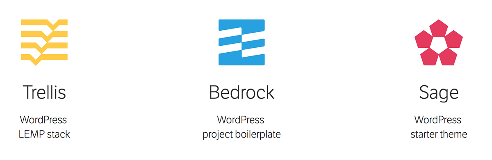

# WordPress Full-stack

> Open-source tools for WordPress application development 🚀

<p align="center">
  <a href="https://roots.io">
    
  </a>
</p>

## Requirements

Make sure you have installed all of the dependencies for [Trellis](https://github.com/roots/trellis#requirements), [Bedrock](https://github.com/roots/bedrock#requirements) and [Sage](https://github.com/roots/sage#requirements) before moving on. At a minimum you need to have:

* [Homebrew](https://brew.sh/)
* [Git]()
* [Ansible](http://docs.ansible.com/ansible/intro_installation.html#latest-releases-via-pip) >= 2.4.0
* [Virtualbox](https://www.virtualbox.org/wiki/Downloads) >= 4.3.10
* [Vagrant](https://www.vagrantup.com/downloads.html) >= 1.8.5
* [Node.js](http://nodejs.org/) >= 6.9.x
* [Yarn](https://yarnpkg.com/en/docs/install)


## Installation

```sh
#
$
```


<p align="center">:fork_and_knife:</p>


## Trellis: WordPress LEMP stack (Server)

> Everything in Trellis is built around the concept of "sites". Each Trellis managed server (local virtual machine or remote server) can support one or more WordPress sites. Trellis will automatically configure everything needed to host a WordPress site such as databases, Nginx vhosts, folder directories, etc.

These sites are configured separatelly for each environment such as `group_vars/<environment>/wordpress_sites.yml`

There are two components and places to configure sites:

- Normal settings in `group_vars/<environment>/wordpress_sites.yml`
- Variables with sensitive data such as passwords in `group_vars/<environment>/vault.yml`

### Development

Development is handled by [Vagrant](https://www.vagrantup.com/) in Trellis. The `Vagrantfile` automatically uses the Ansible provisioner to run the `dev.yml` playbook to get a virtual machine running the WordPress site.

##### Commands ([docs](https://www.vagrantup.com/docs/cli/))
`vagrant up` | `vagrant halt` | `vagrant provision`

##### Accessing MySQL databases ([Sequel Pro](https://www.sequelpro.com/))

##### + [Documentation](https://roots.io/trellis/docs/)


---

### Staging / Production

#### Vault (https://roots.io/trellis/docs/vault/)
Any type of server configs such as this playbook should always be in a __private__ Git repository.

- To view or edit an encrypted `vault.yml` file, use either `ansible-vault view <file>` or `ansible-vault edit <file>`. Avoid using the `decrypt` command. Any time you decrypt a file, you risk forgetting to re-encrypt the file before committing changes to your repo. You may want to employ a pre-commit hook ([example](https://www.reinteractive.net/posts/167-ansible-real-life-good-practices)) for added prevention.

---


<br><br><br>

## Bedrock: WordPress project boilerplate (Application)

Clean **new Bedrock** site: `$ git clone --depth=1 git@github.com:roots/bedrock.git newSite && rm -rf newSite/.git newSite/.github newSite/CHANGELOG.md newSite CODE_OF_CONDUCT.md`

##### + [Documentation](https://roots.io/bedkrock/docs/)


## Sage: WordPress starter theme (Theme)

```sh
# cd site/web/app/themes/
$ composer create-project roots/sage sage9 dev-master
```

### Build commands

- `yarn run start` — Compile assets when file changes are made, start Browsersync session
- `yarn run build` — Compile and optimize the files in your assets directory
- `yarn run build:production` — Compile assets for production

##### + [Documentation](https://roots.io/sage/docs/)


<br /> <br />

##### Official Starter Project

https://github.com/roots/roots-example-project.com

<br /> <br />

## License
This is free software; you can redistribute it and/or modify it under the terms of the MIT license. See [LICENSE](LICENSE) for details.
